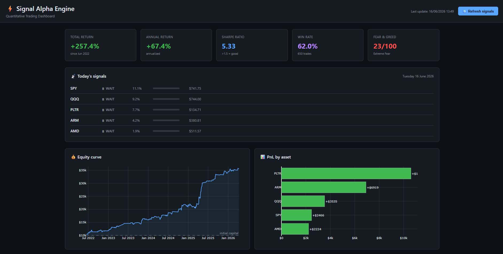
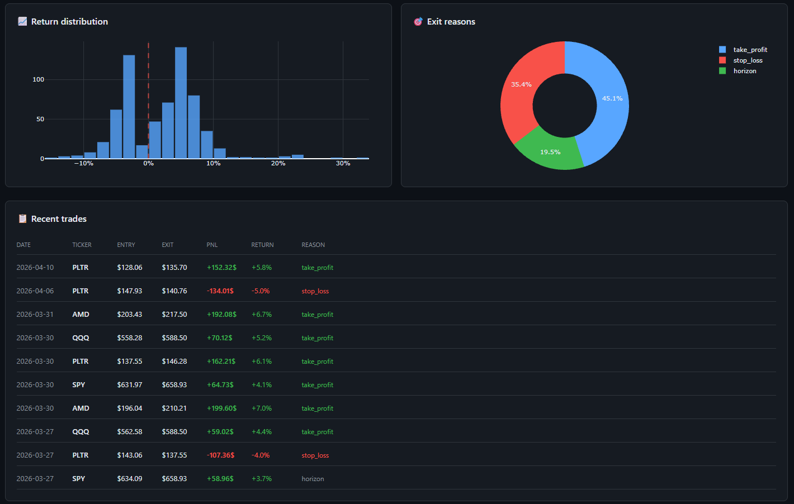

#⚡ Signal Alpha Engine
#A production-ready quantitative trading system built in Python, combining machine learning, technical analysis, and macroeconomic sentiment to generate automated buy signals on US equities and ETFs.

#Performance
#Backtested from June 2022 to April 2026 on a diversified portfolio of 14 US assets with $10,000 initial capital.

#Metric
#Total Return +257%
#Annualized Return ~68% / year
#Sharpe Ratio 5.33
#Win Rate 62%
#Max Drawdown -9.8%
#Total Trades 650
#Profit Factor 1.73
#A Sharpe ratio above 5 places this strategy among the top quantitative funds globally. 
#For reference, the S&P 500 averages ~10% annually with a Sharpe of ~0.5.

#Strategy
#The system implements a Momentum ML Swing Trading strategy — a medium-frequency approach widely used by quantitative hedge funds such as AQR, Two Sigma, and Millennium.
#Every trading day at 1:00 PM, the pipeline downloads fresh market data, generates ML-powered signals, and submits orders to execute before the 3:30 PM NYSE open. Positions are held for a #maximum of 5 trading days, with dynamic take-profit levels and automatic stop-losses.

#Trade rules:
#ParameterValueSignal threshold> 60% model confidencePosition size10% of capital per tradeStop loss-2%Take profit (days 1–3)+5%Take profit (days 4–5)+4%Max holding period5 trading daysFees0.1% per trade

#Universe: AAPL MSFT NVDA GOOGL META JPM GS AMD PLTR ARM SPY QQQ GC=F CL=F

#Architecture
#The system is composed of seven independent modules, each handling a specific stage of the pipeline:
#data_pipeline.py     →  downloads OHLCV data, computes 31 features, builds target variable
#model.py             →  trains LightGBM with Optuna tuning, generates buy/wait signals
#backtest.py          →  simulates trade history with realistic fees and dynamic exit rules
#dashboard.py         →  serves a real-time Dash/Plotly web dashboard
#trader.py            →  executes orders via Alpaca brokerage API
#position_manager.py  →  automatically closes positions after 5 trading days
#notifier.py          →  sends Telegram alerts on every signal and trade
#run_daily.py         →  orchestrates the full pipeline, runs via Windows Task Scheduler
#The model is retrained automatically on the 1st of each month. Between retraining cycles, the saved model is reloaded for fast daily inference.

#Feature Engineering
#The model uses 31 features across three categories:
#Technical indicators — RSI (14), MACD, Bollinger Bands position, ATR normalized, momentum (5/20/60 days), volume anomaly ratio, volume trend, SMA crossovers (20/50/200 days), 52-week high/#low distance, realized volatility (5/20 days), volatility ratio.
#Macroeconomic data — VIX level and 5-day change, US 10-year Treasury rate change, US Dollar Index change, CNN Fear & Greed Index and 5-day change.
#Meta features — Ticker encoding, ATR normalization by price, day of week.

#ML Model
#The signal generator is a LightGBM binary classifier — the same model family used by leading quant funds for medium-frequency equity strategies.
#Training pipeline:

#Temporal train/test split (70/30) — no future leakage
#Optuna hyperparameter search with 50 trials on a held-out validation set
#SHAP values for feature importance and model explainability
#Monthly retraining with automatic model persistence

#Model metrics on out-of-sample test set:
#MetricValueAUC0.63Accuracy66%Precision49%

#Tech Stack
#ToolPurposeLightGBMML signal generationOptunaHyperparameter optimizationSHAPModel explainabilityyfinanceMarket datapandas-taTechnical indicatorsAlpaca APIBrokerage & order executionDash / #PlotlyInteractive web dashboardTelegram Bot APIReal-time trade notifications

#Automation
#The system runs fully autonomously via Windows Task Scheduler:
#13:00 daily  →  run_daily.py         downloads data, generates signals, places orders
#21:50 daily  →  position_manager.py  closes positions held for 5 trading days
#01st monthly →  model.pkl deleted    triggers full model retraining on next run

#Dashboard
#The web dashboard displays in real time:

#Portfolio performance metrics (total return, annualized return, Sharpe ratio, win rate, Fear & Greed Index)
#Today's buy and wait signals with confidence scores and current prices
#Equity curve since inception
#PnL breakdown by asset
#Return distribution histogram
#Last 10 executed trades with entry, exit, PnL, and exit reason

#
#

#Project Structure

#signal-alpha-engine/
#├── data_pipeline.py
#├── model.py
#├── backtest.py
#├── dashboard.py
#├── trader.py
#├── position_manager.py
#├── notifier.py
#├── run_daily.py
#├── model.pkl
#├── data/
#│   ├── features.csv
#│   ├── signals.csv
#│   ├── trades.csv
#│   └── metrics.csv
#└── logs/

#Disclaimer
#This project is for educational and research purposes. Past backtest performance does not guarantee future results. Always validate on paper trading before committing real capital.

#Author
#Gaël Muller — github.com/gaelllllm